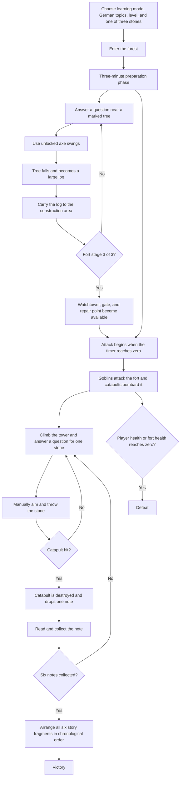

# Waldwacht — Complete Game Mechanics

This document describes the mechanics that are currently implemented in the game. It is intended to make the player's objective, the moment-to-moment actions, and the relationship between the defense and German-learning systems unambiguous.

## 1. The game in one paragraph

The player is the defender of Waldwacht, a forest settlement. During a three-minute preparation phase, the player explores the forest, answers German questions to unlock axe swings, chops trees, carries logs, and builds a three-stage fort. When the attack begins, goblins assault the fort and catapults bombard the walls or the player. From the completed watchtower, the player answers more German questions to earn stones, manually aims each throw, destroys catapults, and collects the six story notes that fall from them. After all six notes have been read, the player must arrange the story fragments in the correct chronological order. Solving that final story task wins the game.

## 2. Complete game flow

The preparation timer and the attack do not advance while a learning question or story panel is open.

## 3. Before the run: player choices

The start screen configures the educational layer before the player enters the forest.

### Test mode

- **Recognition** — the player sees four answer choices and selects the correct one.
- **Recall** — the player types the required German form or answer without seeing choices. The answer is checked by AI when it is configured. A local exact checker is used if the AI evaluator is unavailable.

In recall mode, capitalization, extra spaces, and optional punctuation do not invalidate an otherwise correct answer. The German keyboard substitutions `ae`, `oe`, and `ue` are accepted in place of `ä`, `ö`, and `ü`. If an answer is wrong, the game immediately shows what is wrong and the correct answer. The player must press **Understood** before continuing.

### Language settings

The player can select:

- a German level from **A1, A2, B1, B2, or C1**;
- a grammar topic;
- one of **50 lexical topics**.

These settings determine the question pool. Changing them starts a new pool for that combination.

### Story selection

The player chooses one of three stories:

1. **Die Kartoffel-Lüge**
2. **Heute du, morgen ich**
3. **Elf Tage im Regenwald**

The six notes collected during the run contain consecutive fragments of the selected story, written at the selected German level.

## 4. Controls

| Input | Action |
|---|---|
| `W`, `A`, `S`, `D` | Move |
| Mouse | Look around and aim |
| `Shift` | Run |
| `Space` | Dodge; also grants a short invulnerability window |
| `E` | Context action: answer a question, swing the axe, pick up or deliver a log, use the gate, enter the tower, or prepare a stone |
| Left mouse button | Throw a prepared stone from the watchtower |
| `X` | Leave the watchtower |
| On-screen **Leave Tower** button | Alternative way to leave the watchtower |
| `Escape` | Release the mouse and pause the game |
| Click the paused game | Capture the mouse and continue |
| `F3` | Toggle the navigation debug overlay; this is a diagnostic feature |

While a text field is focused, all letters—including `W`, `A`, `S`, and `D`—are typed normally and do not move the character.

## 5. Exploration and movement

- The player can travel across the entire square forest location.
- The river is not walkable. It must be crossed at the bridge.
- Standing trees, choppable trees, completed construction pieces, fort buildings, interior props, and catapults have collision.
- The player cannot walk through the stage-one or stage-two palisade sections that have already been built. Unbuilt gaps remain passable.
- Catapults remain solid while they patrol, arrive as reinforcements, or stand in place.
- Carrying a heavy log reduces movement speed and disables dodging.

## 6. Preparation phase

The attack begins **180 seconds** after the run starts. Warnings appear at 30 seconds and 10 seconds before the attack.

The intended preparation objective is to build the fort to stage 3 before the timer expires. The player may also prepare additional felled trees or logs for later repairs.

### Time pausing

Simulation time stops when:

- a recognition question is open;
- a recall question is open;
- a wrong-answer explanation is waiting for **Understood**;
- a story fragment is being read;
- the final story-order puzzle is open;
- the game is manually paused after pointer lock is released.

This means the player is not punished by the attack timer while reading, thinking, typing, or reviewing feedback.

## 7. Tree-chopping mechanics

There are 12 designated choppable trees. Ordinary decorative trees cannot be harvested.

### Unlocking axe swings

Each tree requires **four successful axe hits** to fall, but the player cannot swing freely. Axe hits are unlocked by correct German answers for that specific tree:

1. The first correct answer unlocks **two axe swings**.
2. After those two swings have been used, the second correct answer unlocks **all remaining swings needed to fell the tree**—normally two more.

A wrong answer unlocks no swings. That question remains in the learning pool and will return later.

### Performing the chop

After swings have been unlocked, the player stays close to the tree, faces it, and presses `E` once for each swing. Each swing advances the visible cut stage. The notch appears on the side from which the player began chopping.

When the fourth hit lands:

- the authored falling-tree animation plays;
- the tree falls away from the player's chopping position rather than toward the player;
- the fallen trunk remains visible for three seconds;
- the crown then disappears and one large carryable log appears along the fallen trunk's position.

Standing trees block movement. Once a choppable tree has fallen, its standing-trunk collider no longer blocks the player.

## 8. Logs, construction, and repair

### Carrying a log

The player approaches a spawned log and presses `E` to pick it up. Only one log can be carried at a time. While carrying it:

- the first-person model changes to the carrying pose;
- movement speed is reduced;
- dodging is disabled;
- the axe cannot be used.

### Building the fort

The central construction area accepts one log per stage. Press `E` inside the construction radius while carrying a log.

| Delivered construction logs | Result |
|---:|---|
| 1 | Fort stage 1 appears |
| 2 | Fort stage 2 appears and the gate opening is added to the wall |
| 3 | Fort stage 3 completes the fort, watchtower, interior, and animated gate |

Built logs and fort objects are solid. The player must use the actual openings and gate instead of walking through the walls.

### Gate

The finished gate starts open. Near the gate, `E` toggles it. Opening or closing the gate updates the enemy navigation map, causing goblins to recalculate their paths.

### Repair

After stage 3, a carried log can be used at the repair point near the gate. One repair log restores up to **1000 fort health**, which is enough to fully repair any surviving fort. A fort that has already reached zero health cannot be recovered because the run has ended.

## 9. The attack phase

When the timer reaches zero, the game changes from **Preparation** to **Defense**. Six goblins spawn and the three catapults become active.

### Goblins

- Six goblins enter through the navigation system.
- They choose attack points around the fort, avoid bunching together, and recalculate paths when necessary.
- When a goblin reaches the wall, it repeatedly damages the fort.
- Goblins deal 18 fort damage per attack, with roughly 1.4 seconds between attacks.
- The player does not directly fight goblins in the current build. The practical response is to finish the objective quickly, manage the gate, and repair the fort with additional logs.

### Catapults

- Three catapults are active at a time.
- They slowly patrol several metres forward and backward, so their positions are not completely static.
- They fire approximately every 8–14 seconds.
- Most shots target different points on the fort walls. When the player is outside the fort, some shots may target the player's predicted position instead.
- A wall impact deals 70 fort damage.
- A close player impact removes one of the player's three health points.
- A ground miss produces a dirt impact, while a fort hit produces a fort-impact effect.
- Catapults are physical obstacles and cannot be walked through.

## 10. Player health and dodging

The player has **3 health points**. The third successful enemy hit is fatal.

Pressing `Space` performs a fast dodge and grants a short invulnerability window. Dodging can be used to evade incoming catapult stones, but it is unavailable while carrying a log. After taking damage, the player also receives a longer temporary invulnerability period so a single impact cannot immediately remove all health.

## 11. Watchtower and stone throwing

The watchtower becomes usable only after the fort reaches stage 3.

### Entering and leaving

Approach the tower and press `E` to climb it. The player is moved to the platform and normal walking is locked while on the tower.

The player can leave with:

- `X`; or
- the on-screen **Leave Tower** button.

The tower cannot be left while an active question or its feedback panel is open.

### Preparing a stone

Each stone requires one correct German answer:

1. Press `E` on the tower.
2. Complete the selected recognition or recall test.
3. A correct answer prepares exactly one stone.
4. A wrong answer prepares nothing and returns the question to the learning pool.

### Throwing

After a stone is prepared, aim with the center crosshair and press the left mouse button.

The throw is fully ballistic:

- there are no numbered target buttons;
- there is no automatic target lock;
- the stone follows the camera direction at launch and then falls under gravity;
- the player must judge elevation, distance, catapult patrol motion, and flight time.

A miss consumes the stone, so another correct answer is required before another throw.

## 12. Destroying catapults and reinforcements

A catapult is destroyed by **one direct stone hit**.

After destruction:

- the destroyed model appears and emits heavy smoke;
- one story note drops at the destruction point, provided fewer than six notes have been dropped in the run;
- a reinforcement timer begins;
- a replacement catapult enters after approximately 7 seconds, with a small additional delay depending on its slot;
- the replacement arrives at a different available fire position rather than reappearing at exactly the same point;
- after arriving, it resumes its patrol and bombardment.

Only the first six catapult destructions produce notes—one note per destruction. Later destructions produce no additional notes. Because replacements continue to arrive, the objective is not to eliminate every catapult permanently; it is to obtain all six notes and finish the story before the player or fort is destroyed.

## 13. Notes and the story objective

Walk close to a dropped note to collect it. Collection is automatic within the pickup radius.

Each note:

- pauses the game;
- opens a story panel;
- displays the next German fragment of the selected story;
- shows its key phrase;
- advances progress from 1/6 to 6/6.

After the sixth fragment is read and the panel is closed, the final story task opens. The six key phrases are shuffled. The player must place them in the chronological order in which the story happened.

- An incorrect order clears the attempted sequence so it can be rebuilt.
- A correct order completes the selected story and immediately triggers victory, as long as the player and fort still have health remaining.

## 14. The ten-question learning pool

Recognition and recall use the same strict pool structure.

- A pool contains exactly **10 unique questions**.
- A correct answer removes that question from the current pool.
- A wrong answer moves that question to the back of the same pool.
- The next group of 10 is generated only after all 10 current questions have been answered correctly.
- An unfinished pool survives a page reload and resumes where it stopped.
- If AI generation is configured, the server accepts a new batch only when it contains exactly 10 valid, unique questions.
- A malformed or incomplete AI batch produces a visible generation error; it is not silently padded with fallback questions.
- If no AI provider is configured, the game explicitly uses its local question pool.

The same pool supplies both tree questions and tower questions, so mistakes made in either part of the game remain available for later practice.

## 15. HUD and feedback

The main HUD displays:

- player health out of 3;
- fort health out of 1000;
- preparation countdown or the active battle state;
- delivered construction logs out of 3;
- fort construction stage out of 3;
- collected notes out of 6;
- the current objective;
- interaction prompts and chopping progress;
- the heavy-log warning;
- tower aiming instructions;
- damage, dodge, construction, repair, hit, and collection feedback.

## 16. Victory and defeat

### Victory

The player wins by completing all of the following:

1. Build the fort sufficiently to access the watchtower.
2. Destroy enough catapults to obtain all six notes.
3. Collect and read all six story fragments.
4. Arrange the six fragments in the correct chronological order.
5. Keep both the player and the fort alive until the story is solved.

### Defeat

The run ends in defeat if either condition occurs:

- player health reaches 0; or
- fort health reaches 0.

The end screen reports collected notes and remaining fort health. **Start Again** reloads the game world for a new run.

## 17. Recommended first-run strategy

1. Before starting, choose recognition mode if you want visible answer options, or recall mode for free typing.
2. Select the German level, grammar topic, lexical topic, and story you want to practise.
3. Immediately find a marked choppable tree.
4. Answer the first question, use the two unlocked swings, answer the second question, and use the remaining swings.
5. Wait for the fall animation and the three-second trunk phase, then pick up the large log.
6. Deliver it to the central construction area.
7. Repeat until all three fort stages are complete.
8. If time permits, fell an additional tree and leave its log ready for emergency repair.
9. When the attack starts, enter the tower, answer a question, and aim above a catapult to compensate for gravity and movement.
10. Collect each dropped note and read its key phrase carefully.
11. Repair the fort with a spare log if its health becomes dangerous.
12. After the sixth note, reconstruct the story order to win.

## 18. Performance behaviour

The game automatically chooses between normal and low-performance rendering profiles based on available memory, CPU cores, GPU information, and measured frame rate.

The low-performance profile uses:

- the 512-pixel Meshopt-compressed world instead of the normal 1K version;
- no dynamic shadows;
- lower pixel ratio and draw distance;
- fewer particles and decorative plants;
- less frequent environmental animation updates.

Normal computers keep the full profile. If sustained measured FPS is too low, the game can switch to the low profile during play. The profile can also be forced for diagnostics with `?performance=low` or `?performance=normal`.

## 19. What the game is fundamentally about

Waldwacht is not only a fort-defense game and not only a German quiz. Its central loop makes language knowledge a resource:

- correct German answers create the physical actions needed to progress;
- those actions build and maintain the defense;
- combat produces story fragments instead of ordinary score pickups;
- reading comprehension and story sequencing provide the final victory condition.

The player therefore alternates between **learning**, **physical preparation**, **manual aiming**, **resource management**, and **narrative reconstruction**. Every educational task has an immediate game consequence, and every combat objective feeds back into the educational story layer.

## 20. Main implementation references

For developers, the mechanics are primarily implemented in:

- `public/js/fps/main.js` — overall state machine, objectives, input interactions, preparation timer, victory, and defeat;
- `public/js/fps/chopping.js` — question-gated axe hits, fall animation, and log spawning;
- `public/js/fps/fort.js` — construction stages, collisions, gate, damage, and repair;
- `public/js/fps/enemies.js` — goblin navigation, catapult attacks, patrols, destruction, notes, and reinforcements;
- `public/js/fps/tower.js` — tower entry, question gate, ballistic throws, and tower exit;
- `public/js/fps/learning-system.js` — recognition/recall selection, answer flow, pausing, and story integration;
- `see-escape-claude-practical-gates-bDFmc/public/js/learning.js` — levels, topics, strict ten-question pools, retries, and AI/local generation;
- `see-escape-claude-practical-gates-bDFmc/public/js/story-treasures.js` — story fragments and the final ordering puzzle;
- `public/js/fps/config.js` — current balance values.
